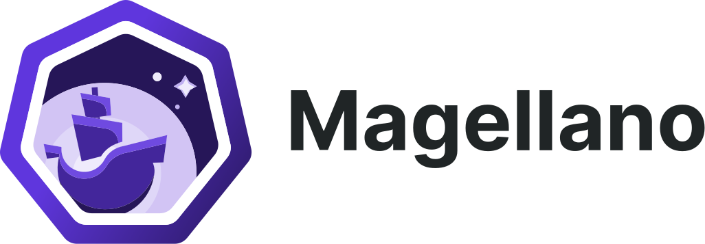

# Mia-Platform Magellano

<picture>
  <source media="(prefers-color-scheme: dark)" srcset="./artworks/horizontal/white/magellano-horizontal-white.svg">
  
</picture>

![Kubernetes]
![License]

This repository contains all the modules, with their flavors, and the add-ons for adding day two operation
capabilities to your Kubernetes clusters.

## Contents of This Repository

The repository contains modules and addons that can be used with [`vab`] for installing them on a Kubernetes cluster.  
These modules and addons are built on a vanilla Kubernetes and are tested against:

- [kind]
- [GKE]
- [EKS]
- [AKS]

The module versioning will follow the kubernetes one for clearly indicating on what version you can use them,
so for example a module with version of 1.24.x will be safe to use on a kubernetes cluster on the 1.24 release.  
Everytime we will certificate the distribution against a new kubernetes version we will cut another release and we will
keep the older one on a separate branch; we pledge to support older releases until the kubernetes version is among the
supported ones.

### Security Features

By default we strive to give the user of Magellano the most secure feature enabled by default for every modules
and addons where possibile. These features are:

- all pods run with dedicated ServiceAccounts with `automountServiceAccountToken` set to false and the
	`kubernetes.io/enforce-mountable-secrets` annotation set to `true` and an empty array of mountable secrets
- every namespace will have a deny-all NetworkPolicy and a set of other NetworkPolicies to allow only the needed
	connections inside and outside the cluster
- only pods that actually needs to be reached inside the cluster will have an associated Service
- pods run with `automountServiceAccountToken` set to false and will have a manual mount of the token,
	CA, and namespace volumes if needed
- `hostNetwork`, `hostPID` and `hostIPC` are explicity set to `false` if the pod don’t need the privilege
- all pods specify the `securityContext` block with this default values:
  - `runAsNonRoot` set to `true` for disallowing the pod to run as root user
  - `runAsUser`, `runAsGroup` and `fsGroup` set to a fixed id as described in the [pod users section](#pod-users-uids-and-gids)
- all containers specify the `securityContext` block with this default values:
  - `allowPrivilegeEscalation` and `privileged` set to `false` if the user inside the pod don’t need to escalate to root
  - `readOnlyRootFilesystem` set to `true` where possibile and appropriates storage mount set on locations that are
		needed
  - `seccompProfile` explicity set to `RuntimeDefault`
  - the `capabilities` block has alwasy the `drop ALL` directive and then in the `add` section will be added only the
		capabilities needed by the program if any
- all pods that expose one or more ports for their functionality will done that in the range between port **11200-11300**
	where possibile. In some cases we cannot change ports or is not advisible (like with cni module). Every module or
	addon will have a dedicated section with the port used in their README file.  
	Avoiding using the default ports and manually selecting different ports that will not overlap with other services will
	ensure that if the end user will have to set the `hostNetwork` property to `true` there will be little to no overlap
	between them so every pod can virtually be placed in the same node of the others without problems

### Pod Users UIDs and GIDs

As best practice we will force a random UID and GID for all users of a pod that are chosen inside the **48000-49000**
range. Every pods will have a different id chosen so no overlap will occour inside and between diffrent modules and
addons. Every module and addon will have a section inside its readme that will explain what id is used on what pod for
transparency.

For working on OpenShift we encourage to setup pathches to remove these selections and leave the automatic assignment
that the cluster will make.

## The Distribution

Magellano is compose of different modules that will install different operators for certain
tasks that are needed in day two operation of a kubernetes clusters. For now only one kind of operator is chosen for
a task but in the future we can support different tools for the same function and the user will be able to select the
components that suites it better.

Additionally to the modules we offers various addons that will build upon one or more module to add premade
functionality that can be useful, a couple of examples are the certification management for the `kube-green`
webhook with `cert-manager` or the addon for adding the `prometheus-operator` CRD for monitoring another module.

### What is a Module or Addon?

A module of Magellano is ultimately a kustomize bundle of yaml manifests that will setup all the resource
needed for setting up a kubernetes operator for managing different function inside the cluster.

An addon of Magellano is a kustomize Component that will add resources and patches to the connected modules
for adding functionality that will need the presence of two different modules inside the cluster.

You can manually donwload and compose the various modules and addons but we also have developed a cli named [`vab`]
that can aid you in the management of them, and the connection and deploy to multiple clusters, and to aid the
operator for a clean installation without retry becasue some resource is not applied in order or becasue a CRD endpoint
is not ready before applying a resource.

## How To Contribute

To contribute to this project you can start reading the [CONTRIBUTING.md](./CONTRIBUTING.md) file for making fixes or
for adding new features. For more in-depth guides you can search in the [docs](./docs) folder and
read the files there.  
If you are unsure or have additional questions please feel free to open an issue, we will be happy to respond as soon
as possible.

[License]: https://img.shields.io/github/license/mia-platform/distribution?color=informational&style=for-the-badge
	"Magellano License"
[Kubernetes]: https://img.shields.io/badge/kubernetes-1.31-success?style=for-the-badge&logo=kubernetes "Supported
	Kubernetes version"
[`vab`]: https://github.com/mia-platform/vab "cli for handling installation and upgrade of Mia-Platform
	unofficial distribution"
[kind]: https://kind.sigs.k8s.io "Kubernetes IN Docker site"
[GKE]: https://cloud.google.com/kubernetes-engine/docs/ "Google Kubernetes Engine documentation site"
[EKS]: https://docs.aws.amazon.com/eks/index.html "Amazon Elastic Kubernetes Service documentation site"
[AKS]: https://learn.microsoft.com/en-us/azure/aks/ "Azure Kubernetes Service documentation site"
